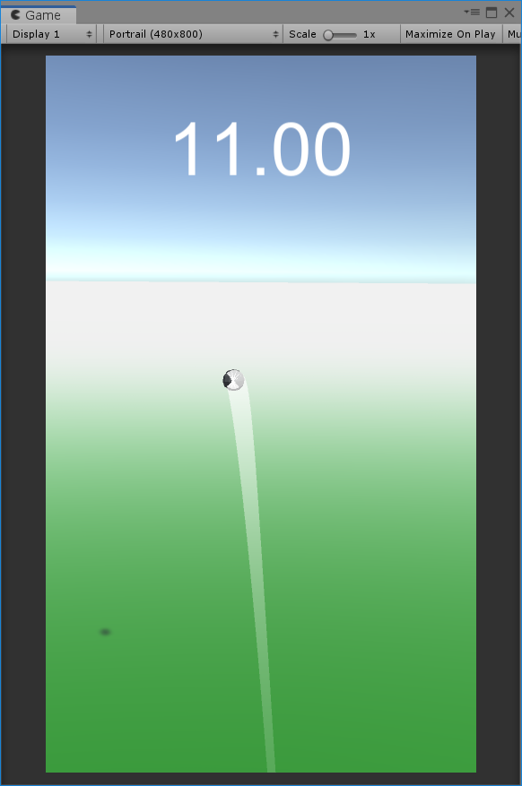

# Big Cannon Mini Game Demo
This is trash project to apply a job as unity developer.

Use key **UP** or **DOWN** to adjust Cannon Shoot Angle.

Hold **SPACE BAR** to charge and shoot a Ball

Design for portrail size (480x800, 1080x1920,...)

Unity plugins use:
- Unity Physics
- Unity UI
- Trail Renderer
- Animator
- Particle System

# Screenshoot

